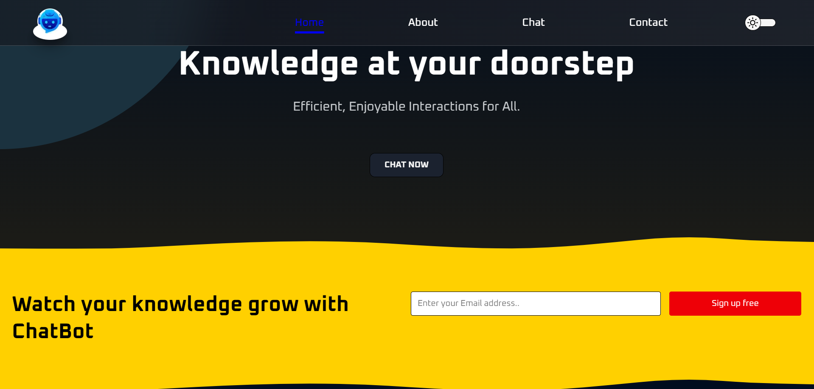
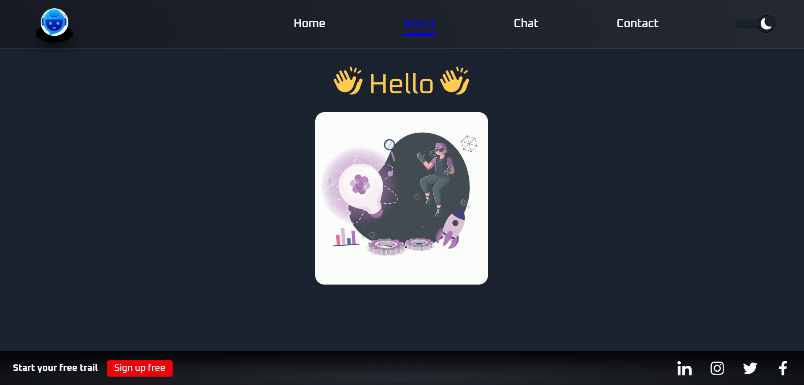
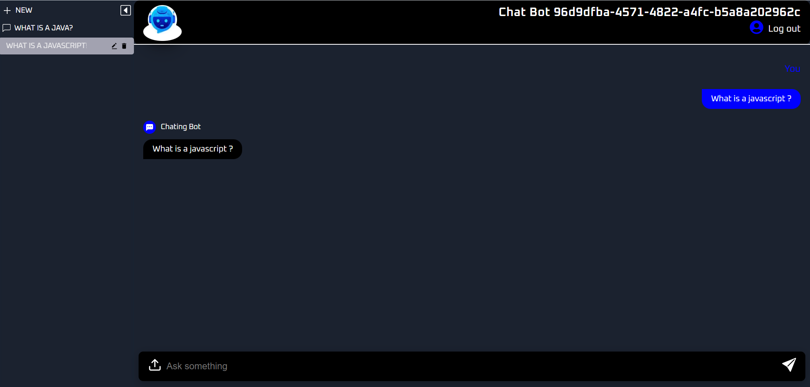

<br />
<div align="center">
<h2 align="center">StreamTalk</h2>
  <p align="center">
      This project is a chatbot website developed using langchain Next.js, MongoDB, and Node.js. The website features a chatbot interface that allows users to interact with the chatbot and receive responses based on predefined rules or machine learning algorithms.
    <br />
    <br />
    <a href="https://github.com/shivam6862/Chatbot/issues">Report Bug</a>
    ·
    <a href="https://github.com/shivam6862/Chatbot/issues">Request Feature</a>
  </p>
</div>

<details>
  <summary>Table of Contents</summary>
  <ol>
    <li>
      <a href="#about-the-project">About The Project</a>
      <ul>
        <li><a href="#built-with">Built With</a></li>
      </ul>
    </li>
    <li><a href="#usage">Description</a></li>
    <li><a href="#usage">Snapshot Gallery</a></li>
    <li><a href="#contributing">Contributing</a></li>
    <li><a href="#contact">Contact</a></li>
    <li><a href="#acknowledgments">Acknowledgments</a></li>
  </ol>
</details>

## About The Project

Welcome to StreamTalk – the next generation chatbot experience! Our project is a cutting-edge chatbot website developed using advanced technologies including Next.js, MongoDB, Node.js, and LangChain. Designed to provide users with a seamless and interactive conversational interface, our chatbot offers more than just scripted responses. It understands the nuances of language, thanks to the powerful natural language processing capabilities of LangChain, making interactions with the chatbot incredibly intuitive and engaging.

Team - `SPSKSJ`

<p align="right">(<a href="#readme-top">back to top</a>)</p>

### Built With

- [next-url]
- [NodeJs-url]
- [Mongodb-url]
- [VisualStudioCode-url]
- [langchain-url]

<p align="right">(<a href="#readme-top">back to top</a>)</p>

## Getting Started

So as to run our project locally, you need to follow the steps below.

### Installation

1. Clone the repo
   ```sh
   git clone https://github.com/shivam6862/Chatbot.git
   ```
2. Install NPM packages on frontend folders
   ```sh
   npm install
   ```
3. Enter your BACKEND URL in `.env` of frontend directory
   ```sh
   NEXT_PUBLIC_BACKEND_URL=http://localhost:8080
   NEXT_PUBLIC_BACKEND_PYTHON_URL=http://localhost:8501
   ```
4. Run the project in frontend using
   ```sh
   npm run dev
   ```
5. You can now view the project at `http://localhost:3000/`

6. Install NPM packages on Backend folders
   ```sh
   npm install
   ```
7. Enter your MONGODB DATABASE URL and put it in `.env` file in backend directory
   ```sh
   MONGODB_URL=your mongodb url
   JWT_SECRET_KEY=Your_key
   FRONTEND_URL=http://127.0.0.1:5173
   CHATBOT_ID=ID
   ```
8. Make the database in your mongodb server named as `Chatbot` and make the following collection and set the data from `./Database/file`
   ```sh
   users
   otps
   conversations
   ```
9. Run the project in backend using
   ```sh
   npm start
   ```
10. Install PIP packages on backendPython folders

    ```sh
    pip install
    ```

11. Enter your keys and put it in `.env` file in backendPython directory

    ```sh
    NEXT_PUBLIC_BACKEND_URL=http://localhost:8080
    API_BOT=YOUR_API_KEY
    ```

12. Run the project in backendPython using
    ```sh
    python main.py
    ```

<p align="right">(<a href="#readme-top">back to top</a>)</p>

<!-- USAGE EXAMPLES -->

## Description

The chatbot website is built using the following technologies:

- **Next.js:** Next.js is a popular React framework that enables server-side rendering, making the website fast and SEO-friendly.
- **MongoDB:** MongoDB is a NoSQL database used to store chatbot responses, user interactions, and other relevant data.
- **Node.js:** Node.js is used for the backend server, handling user requests, and connecting with the MongoDB database.
- **angChain Integration:** LangChain is integrated into the chatbot to enhance natural language understanding and improve the quality of responses. It enables the chatbot to process user input, identify intents, extract entities, and generate contextually relevant replies. By leveraging LangChain's powerful language processing capabilities, the chatbot provides more accurate and meaningful responses to user queries.

## Features

- Interactive chatbot interface.
- Dynamic responses based on user input.
- MongoDB integration for storing chatbot responses and user interactions.
- Next.js for server-side rendering and optimal performance.
- LangChain is integrated into the chatbot to enhance natural language understanding and improve the quality of responses

### Home

The home page serves as the entry point to the chatbot experience. Users land on this page and are greeted with an interactive chatbot interface. They can start conversations, ask questions, and receive responses in real-time. The home page is designed to be user-friendly and engaging, encouraging visitors to interact with the chatbot.

### About

The about page provides detailed information about the chatbot and the technology stack used to build it. It gives users insights into the purpose of the chatbot, its capabilities, and the team behind its development. This section can also include the project's mission, vision, and any unique features that set the chatbot apart from others.
.<br/>

### Chat

The chat page is the heart of the chatbot website. It provides users with a seamless chatting experience, allowing them to have natural conversations with the chatbot. The chat interface is intuitive, supporting various types of queries and responses. Users can ask questions, seek assistance, or simply engage in casual conversations. The chat page showcases the effectiveness of the chatbot's responses and the overall user experience.
<br/>

## Snapshot Gallery

<h2>Home Page</h2>
<a href="https://github.com/shivam6862/Chatbot"></a>
<br/>
<h2>About Page</h2>
<a href="https://github.com/shivam6862/Chatbot"></a>
<br/>
<h2>Chat Page</h2>
<a href="https://github.com/shivam6862/Chatbot"></a>

<p align="right">(<a href="#readme-top">back to top</a>)</p>

<!-- CONTRIBUTING -->

## Contributing

Contributions are welcome! If you're interested in contributing to the project, please follow the guidelines outlined in the CONTRIBUTING.md file. Whether it's fixing bugs, improving user experience, or adding new features, your contributions are valuable in enhancing the chatbot's capabilities.

If you have a suggestion that would make this better, please fork the repo and create a pull request. You can also simply open an issue with the tag "enhancement".
Don't forget to give the project a star! Thanks again!

1. Fork the Project
2. Create your Feature Branch (`git checkout -b feature/AmazingFeature`)
3. Commit your Changes (`git commit -m 'Add some AmazingFeature'`)
4. Push to the Branch (`git push origin feature/AmazingFeature`)
5. Open a Pull Request

<p align="right">(<a href="#readme-top">back to top</a>)</p>

<!-- CONTACT -->

## Contact

Linkedin - [@shivam-kumar](https://www.linkedin.com/in/shivam-kumar-14701b249/)

Project Link: [https://github.com/shivam6862/](https://github.com/shivam6862/)

<p align="right">(<a href="#readme-top">back to top</a>)</p>

<!-- ACKNOWLEDGMENTS -->

## Acknowledgments

Use this space to list resources you find helpful and would like to give credit to. I've included a few of my favorites to kick things off!

- [GitHub Pages](https://pages.github.com)
- [Font Awesome](https://fontawesome.com)
- [MongoDb](https://www.mongodb.com/)

* []() Finally, kudos to the team for the great work `shivam6862`
<p align="right">(<a href="#readme-top">back to top</a>)</p>

[next-url]: https://nextjs.org/docs
[react.js]: https://img.shields.io/badge/React-20232A?style=for-the-badge&logo=react&logoColor=61DAFB
[nodejs-url]: https://nodejs.org/en
[mongodb-url]: https://www.mongodb.com/
[visualstudiocode-url]: https://code.visualstudio.com/
[langchain-url]: https://python.langchain.com/docs/get_started/introduction
